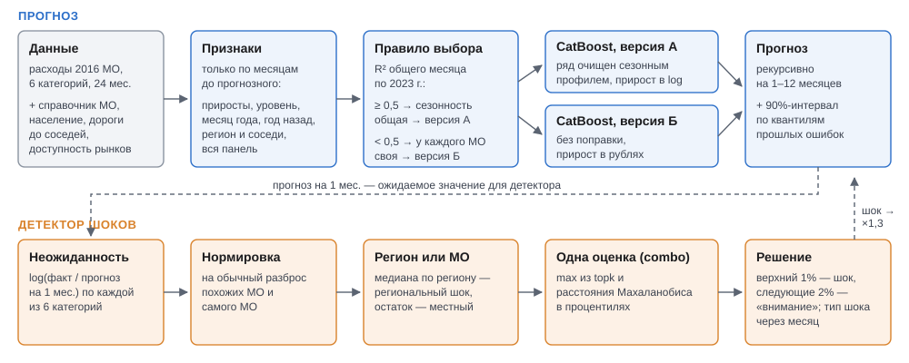

# Прогноз безналичных расходов муниципалитетов и выявление шоков

Решение команды Nomadic forecast для хакатона СберИндекса по муниципальным данным (октябрь 2026 г.): прогноз среднемесячных
безналичных расходов 2016 муниципальных образований (МО) по шести категориям на 1, 3, 6 и 12 месяцев и детектор
шоков - месяцев, когда расходы МО резко разошлись с ожидаемыми.

| | |
|---|---|
| **Интерактивная презентация** | [страница проекта](https://utnasun.github.io/nomadic-forecast/) (исходник — [`docs/`](docs/)) |
| **Методологический отчёт** | [PDF](report/methodology_report.pdf) |



## Архитектура

**Прогноз** ([src/forecast/final.py](src/forecast/final.py)). Одна глобальная модель CatBoost на все МО категории
учится на опыте всех МО сразу и прогнозирует прирост расходов за месяц, рекурсивно, шаг за шагом. Признаки считаются
только по прошлому: недавние приросты, уровень, сезонность год назад, общая динамика панели, доступность рынков,
регион и соседи по дорогам, население. Две версии:

- **А** — прирост в логарифмах; ряды заранее очищаются сезонным профилем, оценённым по самой панели;
- **Б** — прирост в рублях, без сезонной поправки.

Версию для категории выбирает правило, посчитанное по 2023 г., без взгляда на тест: если сезонность у МО почти
одинакова (высокая доля общей для панели динамики), берётся А — это «Все категории» и Продовольствие, иначе Б.

**Детектор шоков** ([src/shocks/detector.py](src/shocks/detector.py)). d = log(факт / прогноз `final` на 1 месяц)
по шести категориям → нормировка на обычный разброс МО → разложение на региональную и местную части → одна оценка
combo (максимум процентилей topk и робастного Махаланобиса) → шок — верхний 1% МО-месяцев. Тип шока (сдвиг уровня,
разовый, нарастающий, провал с отскоком) определяется через месяц.

**Интервалы и 2025 год** ([src/forecast/](src/forecast/)). 90%-интервалы — эмпирические квантили остатков с
поправкой на волатильность МО и недавний шок; прогноз на январь–декабрь 2025 г. по каждому МО.

## Метрики

Протокол расширяющегося окна: минимум 12 месяцев обучения (весь 2023 г.), тест — весь 2024 г. на любом горизонте,
2016 МО с полными рядами. Основная метрика — MAE (руб. на жителя в месяц); также RMSE, WAPE, MAPE, sMAPE, смещение
и R² ([src/evaluation/metrics.py](src/evaluation/metrics.py)).

WAPE, %, среднее по шести категориям, и число сочетаний «категория × горизонт» из 24, где модель точнее Prophet по MAE:

| модель | тип | 1 мес. | 3 мес. | 6 мес. | 12 мес. | точнее Prophet |
|---|---|---|---|---|---|---|
| «как в прошлом месяце» | простая | 7,9 | 9,6 | 11,5 | 12,9 | 12 из 24 |
| «как год назад» × рост | простая | 6,4 | 9,2 | 12,9 | 17,1 | 14 из 24 |
| Prophet по умолчанию | ряд на МО | 8,5 | 9,5 | 10,2 | 13,0 | — |
| ETS | ряд на МО | 8,0 | 9,4 | 11,0 | 12,7 | 11 из 24 |
| Theta | ряд на МО | 7,7 | 9,2 | 11,3 | 14,6 | 11 из 24 |
| ARIMA | ряд на МО | 8,1 | 10,4 | 14,2 | 20,8 | 9 из 24 |
| Chronos-2 | foundation, zero-shot | 7,9 | 9,6 | 12,1 | 15,9 | 9 из 24 |
| CatBoost, версия Б | одна на все МО | 6,3 | 7,9 | 9,2 | 11,6 | 18 из 24 |
| CatBoost, версия А | одна на все МО | 5,2 | 7,9 | 11,1 | 16,9 | 16 из 24 |
| **`final`: версия А или Б по правилу** | одна на все МО | **5,3** | **6,5** | **7,5** | **9,9** | **24 из 24** |

MAE итоговой модели против Prophet, руб. на жителя в месяц:

| категория | 1 мес. | 3 мес. | 6 мес. | 12 мес. |
|---|---|---|---|---|
| Все категории | 810 / 1 805 (−55%) | 1 014 / 1 882 (−46%) | 1 383 / 2 136 (−35%) | 2 038 / 2 720 (−25%) |
| Продовольствие | 294 / 871 (−66%) | 413 / 887 (−53%) | 602 / 918 (−34%) | 743 / 1 086 (−32%) |
| Здоровье | 87 / 119 (−27%) | 86 / 132 (−35%) | 94 / 134 (−30%) | 119 / 180 (−34%) |
| Маркетплейсы | 477 / 511 (−7%) | 561 / 600 (−7%) | 620 / 708 (−12%) | 956 / 957 (0%) |
| Общественное питание | 70 / 142 (−50%) | 90 / 157 (−43%) | 109 / 152 (−28%) | 120 / 182 (−34%) |
| Транспорт | 95 / 149 (−36%) | 130 / 175 (−26%) | 130 / 192 (−32%) | 159 / 241 (−34%) |

**Детектор шоков.** Разметки нет, поэтому детекторы сравниваются на стенде с искусственными сдвигами уровня
([src/shocks/benchmark.py](src/shocks/benchmark.py)). При 1% ложных тревог выбранный детектор находит в месяц шока
47% сдвигов величиной 10% и 83% сдвигов величиной 20% — больше всех из девяти вариантов, включая CUSUM.

**Интервалы.** Покрытие 90%-интервалов на 1–6 месяцев — 91–93%.

Метрики всех моделей — [results/metrics_overall.csv](results/metrics_overall.csv), сравнение детекторов —
[results/shock_benchmark.md](results/shock_benchmark.md).

## Запуск

Положите в корень репозитория файлы хакатона СберИндекса `consumption.parquet`, `market_access.parquet` и
`connection.parquet` ([описание и скачивание](https://sberindex.ru/ru/research/data-sense-opisanie-nabora-dannikh-khakatona-sberindeksa-po-munitsipalnim-dannim)).
Нужен Python 3.10.

```bash
python3 -m venv .venv
source .venv/bin/activate
pip install -r requirements.txt

# справочник МО, население, национальный ряд → data/external/
python -m src.data.external

# прогнозы базовых моделей и итоговой модели, метрики → results/metrics_overall.csv
python -m src.evaluation.run_forecast --models naive prophet_default catboost_diff catboost_logdiff_dsp_g123
python -m src.evaluation.evaluate

# итоговый прогноз → results/forecasts/final/
python -m src.forecast.final

# прогнозы на короткой истории, детектор шоков → results/shocks_v2/, интервалы
python -m src.evaluation.run_forecast --config configs/early.yaml
python -m src.shocks.detector --early results/early
python -m src.forecast.intervals

# прогноз на 2025 год → results/forecast_2025/
python -m src.forecast.forecast_2025
```

Все гиперпараметры лежат в [configs/forecast.yaml](configs/forecast.yaml). Другие сценарии (команды запускаются из активированного окружения):

- все модели сравнения: `python -m src.evaluation.run_forecast` без `--models` (Prophet и ETS/Theta/ARIMA считаются
  по каждому МО — несколько часов), затем `src.evaluation.evaluate`;
- новости: `src.data.news_infini`, `src.data.news_infini --collect`, затем `src.data.news_features` (≈ 42 ГБ трафика, нужен `HF_TOKEN`; для Colab —
  [notebooks/news_infini_colab.ipynb](notebooks/news_infini_colab.ipynb));
- отдельные проверки — модули `src/experiments/`, порядок запуска описан в их docstring;
- данные страницы проекта: `python -m src.viz.site_data` → `docs/data/`.

## Структура репозитория

```
configs/            гиперпараметры протокола и моделей (YAML)
src/
  data/             загрузка панели, внешние данные, новости, календарь Рамадана
  models/           модели с единым интерфейсом forecast(y_train, steps, ctx): простые, ETS/Theta/ARIMA,
                    Prophet, Chronos-2, глобальные CatBoost/Ridge/TabPFN/TabFM
  evaluation/       протокол расширяющегося окна, метрики, прогон моделей, сбор метрик
  forecast/         итоговая модель final, интервалы, прогноз на 2025 г. и его проверка
  shocks/           детектор шоков, первые детекторы, стенд сравнения, восстановление после шока
  experiments/      отдельные проверки: выбор модели, шум от seed, новости, неполные МО и др.
  viz/              EDA, графики, данные для страницы проекта
notebooks/          выгрузка новостей в Colab
docs/               страница проекта (GitHub Pages)
report/             методологический отчёт (PDF), обзор внешних данных
results/            метрики, отчёты проверок, прогнозы final и на 2025 г., шоки
```

## Лицензия

Код — [LICENSE](LICENSE). Данные о расходах, индекс доступности рынков и транспортные связи МО — СберИндекс, лицензия
[CC BY-SA 4.0](https://creativecommons.org/licenses/by-sa/4.0/deed.ru); производные данные в `results/` и
`docs/data/` распространяются на тех же условиях.
