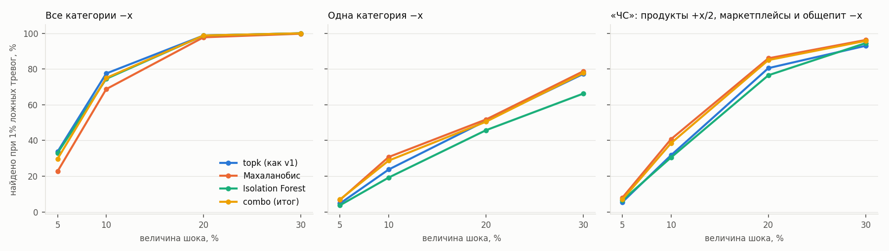
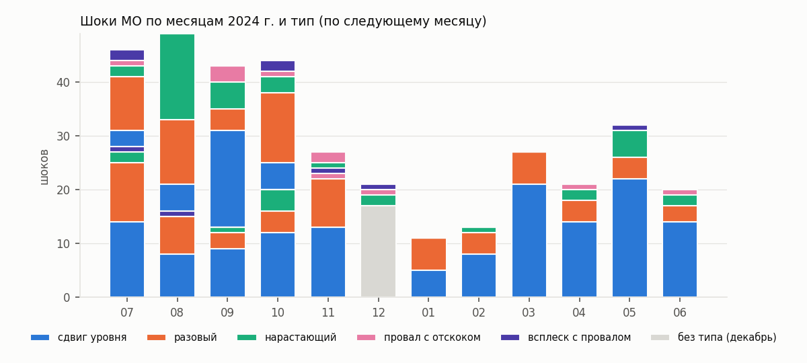
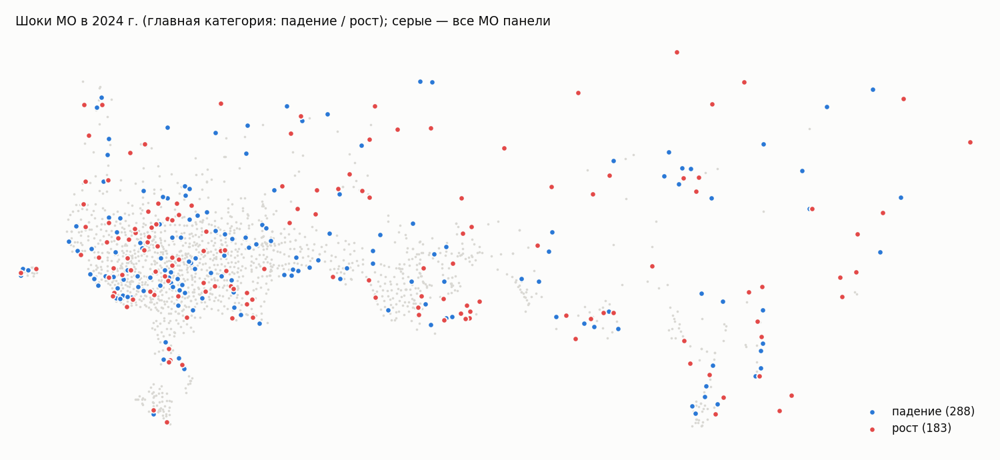

# Шоки v2: неожиданность прогноза, разложение «регион / МО», проверка на искусственных шоках

Как устроено — в docstring `src/shocks/detector.py`. Оценка — `combo` (процентиль), «шок» — верхний 1% МО-месяцев 2024 г., «внимание» — следующие 2%.

## Проверка на искусственных шоках

Доля найденных шоков, %, при пороге с 1% ложных тревог; 400 шоков на прогон. «Весь регион» — 20 случайных регион-месяцев, региональная оценка — с 2% ложных тревог среди регион-месяцев.

|                                                                                    |   x=5% |   x=10% |   x=20% |   x=30% |
|:-----------------------------------------------------------------------------------|-------:|--------:|--------:|--------:|
| ('ЧС: продукты +x/2, маркетплейсы, общепит −x, всего −x/3', 'combo')               |    7   |    38.5 |    85   |    95.8 |
| ('ЧС: продукты +x/2, маркетплейсы, общепит −x, всего −x/3', 'iforest')             |    6.5 |    30.5 |    76.5 |    94.5 |
| ('ЧС: продукты +x/2, маркетплейсы, общепит −x, всего −x/3', 'mahal')               |    8   |    40.8 |    86   |    96.2 |
| ('ЧС: продукты +x/2, маркетплейсы, общепит −x, всего −x/3', 'topk')                |    5.5 |    31.8 |    80.5 |    93   |
| ('ЧС: продукты +x/2, маркетплейсы, общепит −x, всего −x/3', 'topk без разложения') |    3.5 |    24.8 |    73.5 |    91.5 |
| ('весь регион −x', 'topk без разложения (МО региона)')                             |   19.8 |    64.1 |    99.3 |    99.8 |
| ('весь регион −x', 'topk по z_loc (МО региона)')                                   |    2.1 |    10.2 |    17   |    25.8 |
| ('весь регион −x', 'региональная')                                                 |   75   |   100   |   100   |   100   |
| ('все категории −x', 'combo')                                                      |   29.8 |    75   |    98.8 |   100   |
| ('все категории −x', 'iforest')                                                    |   33   |    74.5 |    98.8 |   100   |
| ('все категории −x', 'mahal')                                                      |   22.8 |    68.8 |    97.8 |    99.8 |
| ('все категории −x', 'topk')                                                       |   33.8 |    77.5 |    98.8 |   100   |
| ('все категории −x', 'topk без разложения')                                        |   25   |    72.2 |    98.8 |   100   |
| ('одна категория −x', 'combo')                                                     |    7   |    28.7 |    50.5 |    77.8 |
| ('одна категория −x', 'iforest')                                                   |    3.8 |    19.2 |    45.8 |    66.2 |
| ('одна категория −x', 'mahal')                                                     |    6.8 |    30.8 |    51.7 |    78.8 |
| ('одна категория −x', 'topk')                                                      |    4.8 |    23.8 |    51   |    77.2 |
| ('одна категория −x', 'topk без разложения')                                       |    3.2 |    17.5 |    43   |    72.5 |

По уровню расходов на жителя (квинтили медианы «Все категории»; оценка итоговая), доля найденных, %, и доля ложных тревог в квинтиле при общем пороге:

| расходы на жителя   |   ('все категории −x', 0.1) |   ('все категории −x', 0.2) |   ('одна категория −x', 0.1) |   ('одна категория −x', 0.2) |   ('ложных тревог, %', '') |
|:--------------------|----------------------------:|----------------------------:|-----------------------------:|-----------------------------:|---------------------------:|
| 1 (низкие)          |                        52.1 |                        99.4 |                         14.9 |                         37.2 |                       1.33 |
| 2                   |                        70.8 |                        98   |                         22.8 |                         42.1 |                       0.93 |
| 3                   |                        82.4 |                        99.4 |                         25.6 |                         38.8 |                       0.94 |
| 4                   |                        92.9 |                       100   |                         31.2 |                         74.5 |                       1.01 |
| 5 (высокие)         |                        89.3 |                        98.2 |                         54.2 |                         90.1 |                       0.8  |

## Сколько шоков

Шоков МО: 472, по типам: сдвиг уровня — 272, разовый — 116, нарастающий — 47,  — 17, провал с отскоком — 11, всплеск с провалом — 9
Региональных шоков: 25 из 1242 регион-месяцев.
Постепенных сдвигов (окно из двух месяцев, вне списка шоков), 2024 г.: 143.

По месяцам (шоки МО). Порог — по 2024 г.; месяцы 2023 г. (только с --early) — прогноз с обучением 6–11 мес., шоков там больше, часть из них — лишние тревоги:

|       |   2023-07 |   2023-08 |   2023-09 |   2023-10 |   2023-11 |   2023-12 |   2024-01 |   2024-02 |   2024-03 |   2024-04 |   2024-05 |   2024-06 |   2024-07 |   2024-08 |   2024-09 |   2024-10 |   2024-11 |   2024-12 |
|:------|----------:|----------:|----------:|----------:|----------:|----------:|----------:|----------:|----------:|----------:|----------:|----------:|----------:|----------:|----------:|----------:|----------:|----------:|
| шоков |        46 |        49 |        43 |        44 |        27 |        21 |        11 |        13 |        27 |        21 |        32 |        20 |        28 |        16 |        13 |        20 |        24 |        17 |

## Контрольные случаи (паводок в Оренбургской и Курганской областях, апрель 2024)

| МО       | месяц   |   оценка (процентиль) | уровень   | главное                                                         |
|:---------|:--------|----------------------:|:----------|:----------------------------------------------------------------|
| Орск     | 2024-04 |                  96.2 |           | Продовольствие +7%                                              |
| Орск     | 2024-05 |                  99.8 | шок       | Маркетплейсы +15%; Общественное питание +17%; Все категории +5% |
| Оренбург | 2024-04 |                  24.3 |           |                                                                 |
| Курган   | 2024-04 |                  77.5 |           |                                                                 |

## Новости

Всплеск новостей о ЧС или отключениях (≥3 статей и ≥e× обычного) в тот же месяц, только МО с городом в словаре.

| группа    |   МО-месяцев |   со всплеском новостей, % |
|:----------|-------------:|---------------------------:|
| шок       |          122 |                       5.74 |
| внимание  |          193 |                       1.55 |
| остальные |        11007 |                       2.98 |

## Росстат

Квартальный оборот (крупные и средние организации) г/г к медиане своего региона в квартале шока. Выборки малы — это проверка направления, а не точности.

| Росстат   | категория шока       | группа    |   МО-кварталов |   г/г к региону, медиана, п.п. |
|:----------|:---------------------|:----------|---------------:|-------------------------------:|
| розница   | Продовольствие       | шок вниз  |             18 |                           -1.1 |
| розница   | Продовольствие       | шок вверх |             10 |                           -1.7 |
| розница   | Продовольствие       | без шока  |           8570 |                            0   |
| розница   | Все категории        | шок вниз  |             15 |                           -1.2 |
| розница   | Все категории        | шок вверх |             16 |                            4.2 |
| розница   | Все категории        | без шока  |           8566 |                            0   |
| общепит   | Общественное питание | шок вниз  |             22 |                           -3.4 |
| общепит   | Общественное питание | шок вверх |              8 |                            1.4 |
| общепит   | Общественное питание | без шока  |           5387 |                            0   |

## Крупнейшие шоки МО, 2024 г.

| month   | МО               | регион                  |   score | главное                                                            | тип          |
|:--------|:-----------------|:------------------------|--------:|:-------------------------------------------------------------------|:-------------|
| 2024-05 | Анивский         | Сахалинская область     |  1      | Транспорт -30%; Все категории -16%; Продовольствие -17%            | сдвиг уровня |
| 2024-02 | Богородский      | Кировская область       |  0.9997 | Маркетплейсы +1054%                                                | сдвиг уровня |
| 2024-09 | Прионежский      | Республика Карелия      |  0.9997 | Здоровье -25%; Транспорт -19%                                      | сдвиг уровня |
| 2024-05 | Зилаирский       | Республика Башкортостан |  0.9996 | Общественное питание -52%                                          | сдвиг уровня |
| 2024-05 | Баймакский       | Республика Башкортостан |  0.9995 | Общественное питание -41%                                          | сдвиг уровня |
| 2024-12 | Ильинский        | Ивановская область      |  0.9995 | Маркетплейсы -22%                                                  |              |
| 2024-07 | Южно-Курильский  | Сахалинская область     |  0.9995 | Маркетплейсы +18%                                                  | сдвиг уровня |
| 2024-12 | Барун-Хемчикский | Республика Тыва         |  0.9994 | Здоровье -72%                                                      |              |
| 2024-12 | Сосновский       | Нижегородская область   |  0.9994 | Общественное питание -63%                                          |              |
| 2024-06 | Волгореченск     | Костромская область     |  0.9994 | Все категории -15%; Продовольствие -19%; Здоровье -30%             | сдвиг уровня |
| 2024-04 | Ершичский        | Смоленская область      |  0.9993 | Общественное питание -58%                                          | сдвиг уровня |
| 2024-01 | Долинский        | Сахалинская область     |  0.9992 | Транспорт -32%; Общественное питание -37%; Здоровье -31%           | разовый      |
| 2024-05 | Рамешковский     | Тверская область        |  0.9991 | Маркетплейсы -32%                                                  | сдвиг уровня |
| 2024-05 | Невельский       | Псковская область       |  0.999  | Продовольствие -17%; Все категории -5%; Здоровье -11%              | сдвиг уровня |
| 2024-05 | Макаровский      | Сахалинская область     |  0.999  | Все категории -17%; Продовольствие -7%; Здоровье -22%              | сдвиг уровня |
| 2024-04 | Ковдорский       | Мурманская область      |  0.9989 | Все категории +11%; Продовольствие +3%                             | сдвиг уровня |
| 2024-05 | Волгореченск     | Костромская область     |  0.9988 | Продовольствие -13%; Все категории -10%; Общественное питание -18% | нарастающий  |
| 2024-05 | Хвойнинский      | Новгородская область    |  0.9988 | Продовольствие -5%                                                 | нарастающий  |
| 2024-11 | Мезенский        | Архангельская область   |  0.9988 | Маркетплейсы -42%                                                  | сдвиг уровня |
| 2024-06 | Александровский  | Томская область         |  0.9987 | Маркетплейсы +38%                                                  | сдвиг уровня |
| 2024-09 | Торопецкий       | Тверская область        |  0.9987 | Маркетплейсы -25%; Транспорт +23%; Все категории -7%               | разовый      |
| 2024-03 | Мильковский      | Камчатский край         |  0.9986 | Продовольствие +10%                                                | сдвиг уровня |
| 2024-08 | Устюженский      | Вологодская область     |  0.9986 | Общественное питание -41%                                          | сдвиг уровня |
| 2024-05 | Антроповский     | Костромская область     |  0.9985 | Продовольствие -13%; Все категории -12%; Здоровье -30%             | сдвиг уровня |
| 2024-10 | Торопецкий       | Тверская область        |  0.9985 | Транспорт -18%; Все категории +7%                                  | сдвиг уровня |

## Новости к крупнейшим шокам

Поиск упоминаний МО (город-центр или «… район/округ») в корпусе новостей за месяц шока; «к обычному» — число статей к медиане других месяцев.

| month   | МО                  | регион                          | главное                                                            | новости                  |   статей | тип события     | заголовки                                                                                                                                                        |
|:--------|:--------------------|:--------------------------------|:-------------------------------------------------------------------|:-------------------------|---------:|:----------------|:-----------------------------------------------------------------------------------------------------------------------------------------------------------------|
| 2023-07 | Эвенкийский         | Красноярский край               | Все категории +10%; Общественное питание +65%; Здоровье +49%       | объяснения не найдено    |        2 | nan             | В «Восточно-Сибирской нефтегазовой компании» оценили экономический эффект инноваций - Газета.Ru | Новости | В Сибири десантника-пожарного унесла река            |
| 2024-05 | Анивский            | Сахалинская область             | Транспорт -30%; Все категории -16%; Продовольствие -17%            | объяснения не найдено    |        0 | nan             |                                                                                                                                                                  |
| 2023-08 | Нарьян-Мар          | Ненецкий автономный округ       | Все категории -13%; Здоровье -21%; Общественное питание -12%       | объяснения не найдено    |        3 | nan             | В Нарьян-Маре при проведении акции "Чистые игры" собрали около 100 тонн отходов | В Нарьян-Маре акция «Чистая Арктика» впервые прошла в формате командных соревн |
| 2023-09 | Эвенкийский         | Красноярский край               | Все категории -23%; Общественное питание -48%; Здоровье -27%       | объяснения не найдено    |        0 | nan             |                                                                                                                                                                  |
| 2023-09 | Нарьян-Мар          | Ненецкий автономный округ       | Все категории -16%; Маркетплейсы -19%                              | объяснения не найдено    |        4 | nan             | В Казани изменят количество авиарейсов в Ханты-Мансийск, Нарьян-Мар, Петрозаводск и Горно-Алтайск | В Нарьян-Маре произошел пожар в расселенном доме | Инспектор |
| 2023-12 | Карагинский         | Камчатский край                 | Общественное питание -50%; Маркетплейсы -39%; Продовольствие -1%   | объяснения не найдено    |        1 | nan             | На Камчатке направили 68 млн рублей на благоустройство северных сел                                                                                              |
| 2023-07 | Чурапчинский        | Республика Саха (Якутия)        | Транспорт +56%; Все категории -5%                                  | объяснения не найдено    |        0 | nan             |                                                                                                                                                                  |
| 2023-11 | Вуктыл              | Республика Коми                 | Маркетплейсы -34%; Все категории -11%; Здоровье -15%               | объяснения не найдено    |        0 | nan             |                                                                                                                                                                  |
| 2023-09 | Барятинский         | Калужская область               | Маркетплейсы -30%; Транспорт -31%                                  | объяснения не найдено    |        0 | nan             |                                                                                                                                                                  |
| 2023-08 | Чурапчинский        | Республика Саха (Якутия)        | Транспорт -22%                                                     | объяснения не найдено    |        3 | nan             | В Чурапчинском районе Якутии обнаружили останки древних животных | В российском регионе нашли останки древнего бобра, рыси и росомахи | В малых поселениях Якути |
| 2023-11 | Барун-Хемчикский    | Республика Тыва                 | Общественное питание -29%; Транспорт -16%                          | объяснения не найдено    |        0 | nan             |                                                                                                                                                                  |
| 2023-07 | Амгинский           | Республика Саха (Якутия)        | Транспорт +26%; Все категории -8%                                  | объяснения не найдено    |        0 | nan             |                                                                                                                                                                  |
| 2023-07 | Мамоновский         | Калининградская область         | Здоровье -30%; Все категории -16%                                  | объяснения не найдено    |        1 | nan             | Альбом Петра Мамонова "Фиолетовая черепаха" выйдет в годовщину его смерти 15 июля                                                                                |
| 2024-02 | Богородский         | Кировская область               | Маркетплейсы +1054%                                                | нет в словаре упоминаний |      nan | nan             |                                                                                                                                                                  |
| 2023-10 | Частинский          | Пермский край                   | Здоровье -38%                                                      | объяснения не найдено    |        0 | nan             |                                                                                                                                                                  |
| 2023-08 | Эвенкийский         | Красноярский край               | Все категории -10%; Общественное питание +14%                      | объяснения не найдено    |        3 | nan             | В Эвенкийском районе Красноярского края сняли режим ЧС для борьбы с пожарами в лесах | Потерявшиеся в Бурятии мужчина и подросток самостоятельно вышли из леса | |
| 2024-09 | Прионежский         | Республика Карелия              | Здоровье -25%; Транспорт -19%                                      | объяснения не найдено    |        0 | nan             |                                                                                                                                                                  |
| 2023-07 | Сосновский          | Тамбовская область              | Общественное питание +9600%                                        | нет в словаре упоминаний |      nan | nan             |                                                                                                                                                                  |
| 2023-07 | Усть-Алданский      | Республика Саха (Якутия)        | Маркетплейсы -53%                                                  | объяснения не найдено    |        1 | nan             | Житель Якутии пойдет под суд за вырубку 100 деревьев                                                                                                             |
| 2023-12 | Баймакский          | Республика Башкортостан         | Общественное питание +88%; Продовольствие -5%                      | объяснения не найдено    |        7 | nan             | Две женщины упали в мазутную яму в Башкирии | Две женщины в Башкирии упали в мазутную яму, одна погибла | Жительница Башкирии скончалась после падения в мазутну |
| 2024-05 | Зилаирский          | Республика Башкортостан         | Общественное питание -52%                                          | объяснения не найдено    |        0 | nan             |                                                                                                                                                                  |
| 2023-09 | Лабытнанги          | Ямало-Ненецкий автономный округ | Транспорт -30%; Общественное питание -37%; Все категории -13%      | объяснения не найдено    |        9 | nan             | На Ямале приостановили работу паромной переправы Салехард - Лабытнанги | В Лабытнанги снова загорелась свалка, осложняющая жизнь города | Движение паромов на пе |
| 2024-05 | Баймакский          | Республика Башкортостан         | Общественное питание -41%                                          | объяснения не найдено    |        3 | nan             | В Башкирии загорелась кровля магазина | Пятиклассник из Башкирии поверил блогеру и лишил мать 41 тыс. рублей | Житель Башкирии погиб во время пожара в собственн |
| 2024-12 | Ильинский           | Ивановская область              | Маркетплейсы -22%                                                  | объяснения не найдено    |        0 | nan             |                                                                                                                                                                  |
| 2024-07 | Южно-Курильский     | Сахалинская область             | Маркетплейсы +18%                                                  | нет в словаре упоминаний |      nan | nan             |                                                                                                                                                                  |
| 2023-10 | Дебёсский           | Удмуртская Республика           | Продовольствие -16%                                                | объяснения не найдено    |        1 | nan             | Карантин ввели в Дебесском районе Удмуртии из-за опасных жуков                                                                                                   |
| 2024-12 | Барун-Хемчикский    | Республика Тыва                 | Здоровье -72%                                                      | объяснения не найдено    |        0 | nan             |                                                                                                                                                                  |
| 2024-12 | Сосновский          | Нижегородская область           | Общественное питание -63%                                          | нет в словаре упоминаний |      nan | nan             |                                                                                                                                                                  |
| 2024-06 | Волгореченск        | Костромская область             | Все категории -15%; Продовольствие -19%; Здоровье -30%             | объяснения не найдено    |        0 | nan             |                                                                                                                                                                  |
| 2023-09 | Ямальский           | Ямало-Ненецкий автономный округ | Транспорт -45%; Все категории -22%; Маркетплейсы -26%              | объяснения не найдено    |        2 | nan             | На Ямале поймали, усыпили и увезли в национальный парк медведя, кошмарившего местных жителей | В российском регионе обнаружили древние жилища каменного века     |
| 2023-10 | Коношский           | Архангельская область           | Здоровье -30%                                                      | объяснения не найдено    |        0 | nan             |                                                                                                                                                                  |
| 2023-11 | Чеди-Хольский       | Республика Тыва                 | Общественное питание +36%; Все категории +21%                      | объяснения не найдено    |        0 | nan             |                                                                                                                                                                  |
| 2024-04 | Ершичский           | Смоленская область              | Общественное питание -58%                                          | объяснения не найдено    |        0 | nan             |                                                                                                                                                                  |
| 2023-08 | Карагинский         | Камчатский край                 | Здоровье +37%; Все категории +9%; Продовольствие +7%               | объяснения не найдено    |        1 | nan             | На Камчатке на реке Оссоре зафиксировали самый массовый за десятилетие нерестовый подход                                                                         |
| 2023-07 | Сорск               | Республика Хакасия              | Маркетплейсы -19%; Здоровье +21%                                   | объяснения не найдено    |        1 | nan             | В Хакасии жители пожаловались на детскую площадку «для бессмертных»                                                                                              |
| 2023-07 | Калязинский         | Тверская область                | Маркетплейсы +20%                                                  | объяснения не найдено    |        0 | nan             |                                                                                                                                                                  |
| 2024-01 | Долинский           | Сахалинская область             | Транспорт -32%; Общественное питание -37%; Здоровье -31%           | новостной всплеск        |       10 | nan             | В Долинском районе Сахалинской области объявили предупреждение о лавинной опасности | На Сахалине из-за циклона частично нарушилось автомобильное сообщение | На |
| 2023-07 | Мегино-Кангаласский | Республика Саха (Якутия)        | Транспорт +22%; Все категории -7%                                  | объяснения не найдено    |        1 | nan             | Водитель иномарки насмерть сбил 24-летнего велосипедиста в Якутии                                                                                                |
| 2023-09 | Усинск              | Республика Коми                 | Все категории -16%; Транспорт -27%; Маркетплейсы -8%               | объяснения не найдено    |        3 | nan             | Пьяному поджигателю здания ФСБ в Коми грозит до 20 лет колонии | Поджегший здание УФСБ россиянин предстанет перед судом по статье о теракте | Рейс Бугульма — Ус |
| 2023-09 | Эгвекинот           | Чукотский автономный округ      | Транспорт -26%; Общественное питание -41%; Маркетплейсы -26%       | нет в словаре упоминаний |      nan | nan             |                                                                                                                                                                  |
| 2024-05 | Рамешковский        | Тверская область                | Маркетплейсы -32%                                                  | объяснения не найдено    |        0 | nan             |                                                                                                                                                                  |
| 2023-08 | Кобяйский           | Республика Саха (Якутия)        | Продовольствие -14%; Общественное питание +22%                     | объяснения не найдено    |        1 | nan             | Житель Якутии ожидает суда за незаконную вырубку леса                                                                                                            |
| 2023-08 | Пуровский           | Ямало-Ненецкий автономный округ | Общественное питание -13%; Здоровье -19%; Транспорт -9%            | объяснения не найдено    |        5 | nan             | В Тарко-Сале 2 сентября пройдет бесплатный концерт «Дискотеки Аварии» | Два новых микрорайона появятся в Тарко-Сале | 360° | Экстремальная велогонка состоялась  |
| 2023-07 | Туруханский         | Красноярский край               | Общественное питание +57%; Транспорт +90%; Здоровье +34%           | объяснения не найдено    |        0 | nan             |                                                                                                                                                                  |
| 2024-05 | Невельский          | Псковская область               | Продовольствие -17%; Все категории -5%; Здоровье -11%              | объяснения не найдено    |        0 | nan             |                                                                                                                                                                  |
| 2024-05 | Макаровский         | Сахалинская область             | Все категории -17%; Продовольствие -7%; Здоровье -22%              | нет в словаре упоминаний |      nan | nan             |                                                                                                                                                                  |
| 2023-09 | Кедровый            | Томская область                 | Транспорт -48%; Общественное питание -55%; Здоровье -18%           | нет в словаре упоминаний |      nan | nan             |                                                                                                                                                                  |
| 2024-04 | Ковдорский          | Мурманская область              | Все категории +11%; Продовольствие +3%                             | объяснения не найдено    |        0 | nan             |                                                                                                                                                                  |
| 2023-08 | Балахтинский        | Красноярский край               | Общественное питание +190%                                         | объяснения не найдено    |        0 | nan             |                                                                                                                                                                  |
| 2024-05 | Волгореченск        | Костромская область             | Продовольствие -13%; Все категории -10%; Общественное питание -18% | объяснения не найдено    |        0 | nan             |                                                                                                                                                                  |
| 2024-05 | Хвойнинский         | Новгородская область            | Продовольствие -5%                                                 | объяснения не найдено    |        0 | nan             |                                                                                                                                                                  |
| 2024-11 | Мезенский           | Архангельская область           | Маркетплейсы -42%                                                  | объяснения не найдено    |        0 | nan             |                                                                                                                                                                  |
| 2023-10 | Спас-Деменский      | Калужская область               | Продовольствие -18%; Общественное питание -28%; Здоровье -2%       | объяснения не найдено    |        0 | nan             |                                                                                                                                                                  |
| 2024-06 | Александровский     | Томская область                 | Маркетплейсы +38%                                                  | нет в словаре упоминаний |      nan | nan             |                                                                                                                                                                  |
| 2024-09 | Торопецкий          | Тверская область                | Маркетплейсы -25%; Транспорт +23%; Все категории -7%               | новостной всплеск        |       80 | атаки и теракты | В Торопецком округе Тверской области ввели запрет на посещение лесов | Названо число пострадавших при атаке беспилотников на Торопец - Газета.Ru | Новости | Ата |
| 2023-10 | Прионежский         | Республика Карелия              | Здоровье -18%; Продовольствие -14%                                 | объяснения не найдено    |        1 | nan             | Туристов из Петербурга нашли мёртвыми в Карелии                                                                                                                  |
| 2024-03 | Мильковский         | Камчатский край                 | Продовольствие +10%                                                | объяснения не найдено    |        0 | nan             |                                                                                                                                                                  |
| 2023-07 | Булунский           | Республика Саха (Якутия)        | Общественное питание +48%; Все категории +11%                      | объяснения не найдено    |        0 | nan             |                                                                                                                                                                  |
| 2024-08 | Устюженский         | Вологодская область             | Общественное питание -41%                                          | объяснения не найдено    |        0 | nan             |                                                                                                                                                                  |
| 2024-05 | Антроповский        | Костромская область             | Продовольствие -13%; Все категории -12%; Здоровье -30%             | объяснения не найдено    |        0 | nan             |                                                                                                                                                                  |

## Крупнейшие региональные шоки

| month   | регион                                   |   score |   МО | главное                                                           | примечание                                             |
|:--------|:-----------------------------------------|--------:|-----:|:------------------------------------------------------------------|:-------------------------------------------------------|
| 2023-09 | Ямало-Ненецкий автономный округ          |    2.68 |   13 | Общественное питание -3.0σ, Все категории -2.8σ, Здоровье -2.2σ   |                                                        |
| 2023-08 | Ямало-Ненецкий автономный округ          |    2.53 |   13 | Здоровье -2.7σ, Общественное питание -2.6σ, Все категории -2.3σ   |                                                        |
| 2023-10 | Ямало-Ненецкий автономный округ          |    2.44 |   13 | Здоровье -2.8σ, Общественное питание -2.4σ, Все категории -2.1σ   |                                                        |
| 2023-09 | Республика Саха (Якутия)                 |    2.04 |   29 | Здоровье -2.2σ, Общественное питание -2.2σ, Все категории -1.6σ   |                                                        |
| 2023-07 | Ямало-Ненецкий автономный округ          |    1.98 |   13 | Здоровье +2.1σ, Транспорт +2.1σ, Все категории +1.7σ              |                                                        |
| 2024-01 | Республика Тыва                          |    1.93 |   10 | Продовольствие -2.3σ, Все категории -1.9σ, Маркетплейсы -1.5σ     | модель не видела января — вероятно, сезонность региона |
| 2024-09 | Ямало-Ненецкий автономный округ          |    1.92 |   13 | Здоровье -2.4σ, Общественное питание -2.1σ                        |                                                        |
| 2024-01 | Республика Алтай                         |    1.89 |   11 | Все категории -2.6σ, Продовольствие -1.7σ, Маркетплейсы -1.0σ     | модель не видела января — вероятно, сезонность региона |
| 2023-12 | Камчатский край                          |    1.76 |    9 | Маркетплейсы -2.2σ, Продовольствие +1.9σ                          |                                                        |
| 2023-09 | Сахалинская область                      |    1.76 |   16 | Здоровье -1.8σ, Общественное питание -1.7σ, Все категории -1.7σ   |                                                        |
| 2024-02 | Республика Калмыкия                      |    1.76 |    5 | Все категории -2.3σ, Здоровье -1.7σ, Продовольствие -1.1σ         |                                                        |
| 2023-07 | Республика Калмыкия                      |    1.66 |    5 | Продовольствие +2.8σ                                              |                                                        |
| 2023-09 | Ханты-Мансийский автономный округ — Югра |    1.63 |   22 | Транспорт -1.8σ, Все категории -1.8σ, Общественное питание -1.3σ  |                                                        |
| 2024-12 | Камчатский край                          |    1.59 |    9 | Маркетплейсы -2.5σ                                                |                                                        |
| 2023-07 | Ханты-Мансийский автономный округ — Югра |    1.57 |   22 | Транспорт +2.3σ, Продовольствие +1.1σ, Общественное питание +1.1σ |                                                        |
| 2024-01 | Камчатский край                          |    1.56 |    9 | Продовольствие -2.2σ, Общественное питание -1.3σ                  | модель не видела января — вероятно, сезонность региона |
| 2023-08 | Республика Калмыкия                      |    1.55 |    5 | Все категории +2.2σ, Продовольствие +1.3σ                         |                                                        |
| 2023-09 | Хабаровский край                         |    1.53 |   16 | Общественное питание -1.7σ, Здоровье -1.6σ, Все категории -1.2σ   |                                                        |
| 2024-01 | Сахалинская область                      |    1.52 |   16 | Общественное питание -1.8σ, Здоровье -1.7σ                        | модель не видела января — вероятно, сезонность региона |
| 2024-08 | Приморский край                          |    1.51 |   33 | Маркетплейсы -2.1σ, Продовольствие +1.1σ, Здоровье -1.1σ          |                                                        |
